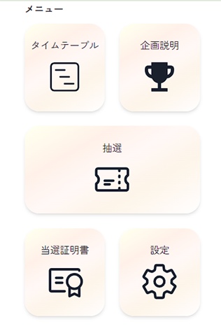

# 抽選券システムのドキュメント

## はじめに

昨年度までの灘校文化祭ではクラブ・サークルの人気企画に対し、文化委員会が一つの教室で整理券を配り抽選を行っていた。今年度からはオンラインサイトによるシステムを導入し、抽選業務を完全に自動化するのが抽選券システムである。

基本的な技術構成について、以下に示す。

Next.jsのApp Routerでフロントエンドおよびバックエンドを一つのプロジェクトで管理する。また、Prismaを使ってPostgresに接続し、データベースを管理する。

一部UIライブラリとしてChakra UIを採用している。

## 目次

- [抽選券システムのドキュメント](#抽選券システムのドキュメント)
  - [はじめに](#はじめに)
  - [目次](#目次)
  - [外部連携](#外部連携)
  - [その他のマークダウンファイル](#その他のマークダウンファイル)
  - [環境変数](#環境変数)
  - [データベーススキーマ](#データベーススキーマ)
  - [抽選仕様](#抽選仕様)
    - [当選ID](#当選id)
  - [各フォルダーの説明](#各フォルダーの説明)
    - [app](#app)
      - [(admin)](#admin)
        - [(admin)/admin?secret={ADMIN_SECRET}](#adminadminsecretadmin_secret)
        - [(admin)/club?secret={CLUB_SECRET}](#adminclubsecretclub_secret)
      - [(auth)](#auth)
        - [(auth)/login](#authlogin)
        - [(auth)/register?secret={SECRET}](#authregistersecretsecret)
      - [(app)](#app-1)
        - [(app)/certifications](#appcertifications)
        - [(app)/events](#appevents)
        - [(app)/news](#appnews)
        - [(app)/news?id={id}](#appnewsidid)
        - [(app)/raffle](#appraffle)
        - [(app)/settings](#appsettings)
        - [(app)/timetable](#apptimetable)
      - [(auth)](#auth-1)
        - [(auth)/login](#authlogin-1)
        - [(auth)/register?secret={secret}](#authregistersecretsecret-1)
        - [(auth)/terms](#authterms)
    - [api](#api)
      - [(admin)](#admin-1)
        - [(admin)/cron](#admincron)
        - [(admin)/exec](#adminexec)
        - [(admin)/reset](#adminreset)
      - [(app)](#app-2)
        - [(app)/events](#appevents-1)
        - [(app)/raffle](#appraffle-1)
        - [(app)/result](#appresult)
        - [(app)/subscribe](#appsubscribe)
        - [(app)/user (POST)](#appuser-post)
        - [(app)/user (PUT)](#appuser-put)
      - [(auth)](#auth-2)
        - [(auth)/login](#authlogin-2)
        - [(auth)/register](#authregister)
        - [(auth)/logout](#authlogout)
        - [/test](#test)
    - [components](#components)
      - [Terms](#terms)
      - [ui/BreadCrumbs](#uibreadcrumbs)
      - [Footer](#footer)
      - [Header](#header)
      - [LogoutButton](#logoutbutton)
      - [NewsList](#newslist)
      - [Notification](#notification)
      - [RaffleNews](#rafflenews)
      - [TicketCard](#ticketcard)
      - [TypeKit](#typekit)
    - [lib](#lib)
      - [client/\*\*](#client)
      - [email](#email)
      - [lang](#lang)
      - [server](#server)
        - [cms](#cms)
        - [cron](#cron)
        - [db](#db)
        - [fetchNews](#fetchnews)
        - [getRaffleId](#getraffleid)
        - [raffle](#raffle)
        - [session](#session)
      - [types](#types)
    - [worker](#worker)
    - [Dockerfile](#dockerfile)
    - [middleware](#middleware)
  - [サイトイメージ](#サイトイメージ)
    - [登録用フォーム](#登録用フォーム)
    - [登録用フォーム2](#登録用フォーム2)
    - [登録用フォーム3](#登録用フォーム3)
    - [ログイン画面](#ログイン画面)
    - [本人確認メール](#本人確認メール)
    - [お知らせ一覧](#お知らせ一覧)
    - [お知らせ詳細](#お知らせ詳細)
    - [抽選フォーム](#抽選フォーム)
    - [メニュー](#メニュー)
    - [当選メール](#当選メール)
    - [当選証明書](#当選証明書)

## 外部連携

- MicroCMS
- Google Gmail API

## その他のマークダウンファイル

[デプロイ方法](./deploy.md)

[利用規約](./terms.md)

## 環境変数

- `SECRET` : 登録リンクにアクセスする
- `JWTSECRET` : セッションの暗号化に伴うJWTの暗号化に使う文字列
- `ADMIN_SECRET` : 管理者用のパスワード
- `CLUB_SECRET` : クラブ用のパスワード

- `POSTGRES_PRISMA_URL` : PrismaのPostgres接続用URL
- `POSTGRES_URL_NON_POOLING` : PrismaのPostgres接続用URL
- `MICROCMS_SERVICE_DOMAIN` : MicroCMSのサービスドメイン
- `MICROCMS_API_KEY` : MicroCMSのAPIキー
- `NEXT_PUBLIC_ADOBE_FONT_ID` : Adobe FontsのフォントID

- `GOOGLE_USER` : Gmailの送信元メールアドレス
- `GOOGLE_CLIENT_ID` : GmailのOAuthクライアントID
- `GOOGLE_CLIENT_SECRET` : GmailのOAuthクライアントシークレット
- `GOOGLE_REFRESH_TOKEN` : GmailのOAuthリフレッシュトークン

- `HOST` : サイトのホスト名
- `DISCORD_WEBHOOK_URL` : デバッグ用のDiscordのWebhook URL

- `NEXT_PUBLIC_VAPID_PUBLIC_KEY` : Web PushのVAPID公開鍵
- `VAPID_PRIVATE_KEY` : Web PushのVAPID秘密鍵

## データベーススキーマ

```prisma
generator client {
  provider      = "prisma-client-js"
  binaryTargets = ["native"]
}

datasource db {
  provider  = "postgresql"
  url       = env("POSTGRES_PRISMA_URL")
  directUrl = env("POSTGRES_URL_NON_POOLING")
}

model User {
  uuid         String   @id @default(uuid())
  email        String   @unique
  notification Boolean  @default(true)
  raffle       Raffle[]
  pushNotification PushNotification[]
}

model Raffle {
  uuid         String @id @default(uuid())
  eventId      Int
  timeId       Int
  userId       String
  participants Int
  result       Result @default(PROCESSING)
  user         User   @relation(fields: [userId], references: [uuid])

  @@unique([eventId, timeId, userId], name: "unique_raffle")
}

model PushNotification{
  uuid String @id @default(uuid())
  userId String
  endpoint String
  p256dh String
  auth String
  user User @relation(fields: [userId], references: [uuid])
}

enum Result {
  WIN
  LOSE
  PROCESSING
}
```

## 抽選仕様

### 当選ID

当選IDは、イベント名、時間帯、当日の日付ごとに一意のIDを持つ。具体的にはこれらの文字列をハッシュ化することで生成される。

## 各フォルダーの説明

### app

next.jsのapp routerが入っている。

#### (admin)

管理者用ページ。

##### (admin)/admin?secret={ADMIN_SECRET}

管理者用ページ。サーバーの管理や技術的な操作を行うことのできる人物がいないときにこのページにアクセスしてもらう。

##### (admin)/club?secret={CLUB_SECRET}

クラブ用ページ。クラブの代表者が抽選IDを確認するために使う一覧ページ。

#### (auth)

認証ページ。

##### (auth)/login

ログインページ。メールアドレスを入力し、届く確認メールからログインする。

##### (auth)/register?secret={SECRET}

登録ページ。

- 注意事項を読む。
- 利用規約を読む。
- メールアドレスを入力し、登録ボタンを押す。
- 認証メールが届く。

このページは当日のパンフレットおよびポスターからしかアクセスできない。(secretが必要)

#### (app)

アプリ本体。セッション処理についてはmiddlewareを参照。

##### (app)/certifications

当選証明書を一覧で表示する。

`/certifications?eventId={eventId}&timeId={timeId}`とすれば、対応する抽選IDの当選証明書を一番に表示する。

##### (app)/events

イベント一覧を表示する。

`/events?eventId={eventId}&timeId={timeId}`とすれば、対応する抽選IDのイベントを一番に表示する。

##### (app)/news

お知らせ一覧を表示する。`components/NewsList`を参照。

##### (app)/news?id={id}

お知らせの詳細を表示する。idがMicroCMSの記事IDに対応する場合と、抽選データのUUIDに対応する場合がある。

##### (app)/raffle

抽選ページ。企画名、時間帯、人数を入力して`/api/raffle`にPOSTリクエストを送る。
`/raffle?eventId={eventId}&timeId={timeId}`とすれば、対応する企画をフォームに事前入力しておく。

##### (app)/settings

設定ページ。メールアドレスとメール通知を受け取るかどうか変更できる。

##### (app)/timetable

タイムテーブルを表示する。タイムテーブル内の企画をクリックすると`/raffle?eventId={eventId}&timeId={timeId}`に飛ぶ。

#### (auth)

##### (auth)/login

メールアドレスを入力してボタンを押したのち、`/api/login`にPOSTリクエストを送る。
再送信用ボタンを用意しておく。

##### (auth)/register?secret={secret}

1. 注意事項を読ませる
2. 利用規約に同意させる
3. メールアドレスを登録させる
4. 本人確認用にメールを送る

メールを送るとき`/api/register`にPOSTリクエストを送る。bodyにsecretを入れる。

再送信用ボタンを用意しておく。

##### (auth)/terms

利用規約を見れるようにする。

### api

`api/{パス}`でアクセスできるエンドポイントが入っている。

レスポンスは以下のラッピングがされている。

session管理についてはmiddlewareを参照。

ユーザーのuuidについてはsessionから取得されている。

sessionがない場合、401を返す。

リクエストスキーマが不正な場合、400を返す。

```ts
{
  ok: boolean,
  data: any
}
```

#### (admin)

管理者権限でのみリクエストできる。middlewareを参照。

##### (admin)/cron

管理者権限ではなくx-secretヘッダーが必要。

```ts
//ヘッダー
"x-secret": {ADMIN_SECRET}
```

抽選が行われる時間帯になっていることを確認し、抽選を行う。バックエンドで別に用意するべきか。

##### (admin)/exec

```ts
//リクエスト
{
  eventId: number,
  timeId: number,
  capacity: number
}
```

抽選を個別に実行する。adminページで手動で抽選を行うときに使う。

##### (admin)/reset

抽選情報(raffleテーブル)をリセットする。文化祭の一日目二日目の間に実行する。

#### (app)

##### (app)/events

```ts
//リクエストなし
{
}
```

```ts
//レスポンス200
{
  data: {
    events: Array<EventSchema & MicroCMSContentId & MicroCMSDate>;
  }
}
```

cmsから得たイベント情報を返す。クライアント側でこれを利用する。

##### (app)/raffle

```ts
//リクエスト
{
  eventId: number,
  timeId: number,
  participants: number
}
```

```ts
//レスポンス200
{
  data: Raffle;
}
```

```ts
//レスポンス409
//すでに抽選されている。もしくは時間帯が衝突している。
```

抽選登録を行う。

##### (app)/result

```ts
//リクエストなし
{
}
```

```ts
//レスポンス200
{
  data: {
    raffle: Array<Raffle>;
  }
}
```

##### (app)/subscribe

```ts
//リクエスト
{
  endpoint: string,
  p256dh: string,
  auth: string
}
```

```ts
//レスポンス200
{
}
```

Web Push通知を受け取るためのエンドポイントを登録する。

##### (app)/user (POST)

```ts
//リクエストなし
{
}
```

```ts
//レスポンス200
{
  data: {
    email: string,
    uuid: string,
    notification: boolean,
  }
}
```

##### (app)/user (PUT)

```ts
//リクエスト
{
  email?: string,
  notification?: boolean
}
```

メールアドレスと通知設定を変更する。

#### (auth)

##### (auth)/login

```ts
//リクエスト
{
  email: string;
}
```

```ts
//レスポンス200
{
  data: {
    email: string,
    uuid: string,
    notification: boolean,
  }
}
```

テーブルからユーザーを取得し、セッションを発行した後、認証メールを送る。

##### (auth)/register

```ts
//リクエスト
{
  email: string,
  secret: string//環境変数「SECRET」
}
```

```ts
//レスポンス401 secretが違う
//レスポンス409 すでに登録されている
//レスポンス201 登録成功
```

ユーザーを作成し、セッションを発行した後、認証メールを送る。

##### (auth)/logout

クッキー「admin」「token」を削除する。

##### /test

テスト用。後で処理を消すのを忘れないように。

### components

あくまでReact用ではあるが、コンポーネントをまとめておく。参考用。

#### Terms

利用規約を表示するコンポーネント。

#### ui/BreadCrumbs

パンくずリストを表示するコンポーネント。

#### Footer

#### Header

#### LogoutButton

#### NewsList

#### Notification

#### RaffleNews

#### TicketCard

#### TypeKit

Adobe Fontsを表示するためのローダーコンポーネント。

### lib

#### client/\*\*

React用。クライアント用のフックなど。

#### email

Gmail APIを使ってメールを送信する。componentsやtemplateフォルダにあるメールテンプレートを使ってメールを送信する。

環境変数、`GOOGLE_USER`, `GOOGLE_CLIENT_ID`, `GOOGLE_CLIENT_SECRET`, `GOOGLE_REFRESH_TOKEN`が必要。

#### lang

サイトの言葉をすべてここにまとめた。正直まとめなくてよかったかもしれない。表記揺れは防げるが...

#### server

##### cms

MicroCMSからデータを取得する。`MICROCMS_SERVICE_DOMAIN`, `MICROCMS_API_KEY`が必要。

##### cron

`/api/admin/cron`にアクセスすると、抽選を行う。

##### db

##### fetchNews

①お知らせ②抽選の結果に分けて、ニュースをfetchする。

##### getRaffleId

当選IDを取得する関数。日付＋企画ID＋時間IDの`string`をハッシュ化し、上三桁を取得する。

##### raffle

抽選方法が公平といわれるかと微妙であるが、以下の方法で抽選する。

データベースから抽選登録をした人の数に合わせて配列を作成する。i人での登録がj組(`array[i]=j;`)

その配列より人数を小さくした配列に対して合計がcapacity人となるようにする。（そのような配列が見つからなかったならば、capacityを1ずつ減らしていく。）

その分布配列にしたがって、ランダムにユーザーを選び出し当選者と落選者を決める。

##### session

- validation

  cookie「token」の値を取得し、jwtで署名されたことを確認する。クッキー「admin」=={ADMIN_SECRET}の場合、adminフラグを立てる。

  ```js
  {
    uuid:string,
    email:string,
    admin:boolean
  }
  ```

- generateSession
  ```js
  {
    uuid:string,
    email:string
  }
  ```
  を{JWT_SECRET}でJWTとして署名する。有効期限は二日間とする。

#### types

```ts
type Event = {
  id: number;
  name: string;
  description?: string;
  time: Time[];
  location?: string;
  image?: string;
  capacity: number;
};

type Session = {
  uuid: string;
  email: string;
  admin: boolean;
};
```

### worker

サービスワーカー

### Dockerfile

### middleware

URLパラメータ「token」「secret」を取得する。

- tokenがある場合、クッキーに「token」をセットし、ホームにリダイレクトする。
- secret=={ADMIN_SECRET}の場合、adminクッキーに同じ値をセットする。
- secret=={SECRET}の場合、`/register`にリダイレクトする。
- その他の場合、`/login`にリダイレクトする。

## サイトイメージ

### 登録用フォーム


### 登録用フォーム2


### 登録用フォーム3


### ログイン画面


### 本人確認メール


### お知らせ一覧


### お知らせ詳細


### 抽選フォーム


### メニュー



### 当選メール


### 当選証明書


